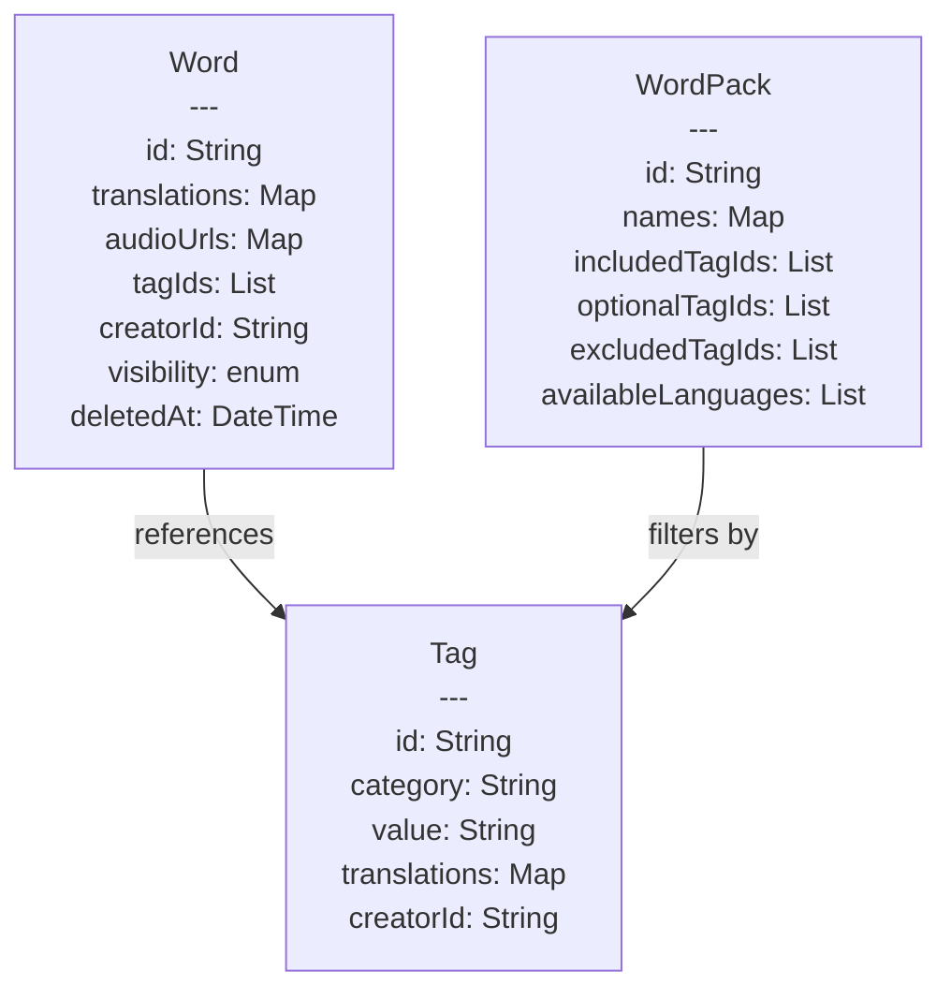
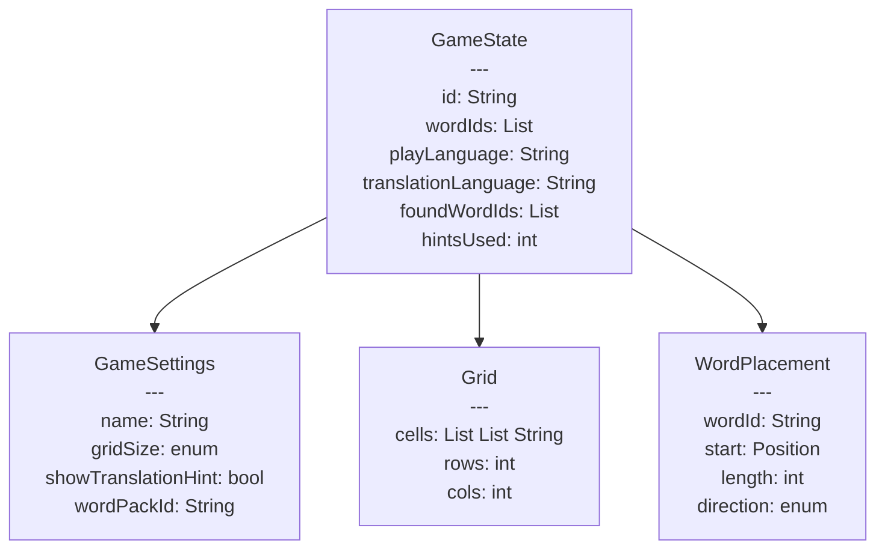
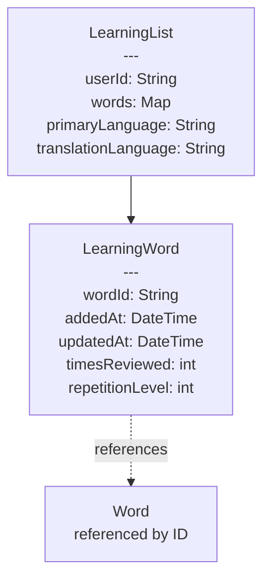
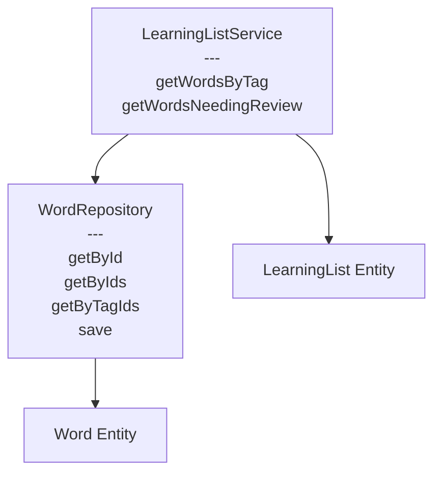
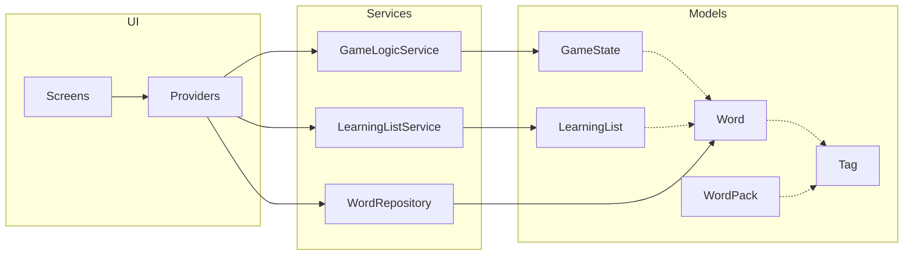

# Class Diagram

This document shows the complete data model and relationships for the Word Game app.

## Overview

The architecture follows clean architecture principles with:
- **Models**: Immutable data classes (using freezed)
- **Repositories**: Data access layer
- **Services**: Business logic layer
- **Providers**: State management (Riverpod)

## Core Entities



## Game System



## Learning System



## Service Layer



## Complete Architecture Overview



## Enumerations

### WordVisibility
- `public` - visible to all, searchable
- `private` - only visible to creator
- `unlisted` - visible with direct link

### GridSize
- `small_10x10` - 10x10 grid
- `medium_15x15` - 15x15 grid
- `large_20x20` - 20x20 grid

### Direction
Word placement directions in grid:
- `horizontal` / `horizontalReverse`
- `vertical` / `verticalReverse`
- `diagonalDown` / `diagonalDownReverse`
- `diagonalUp` / `diagonalUpReverse`

## Static Helper Classes

### TagCategories
Standardized tag category names:
```dart
static const String cefr = 'cefr';           // A1, A2, B1, B2, C1, C2
static const String topic = 'topic';         // animals, food, travel, etc.
static const String wordType = 'word_type';  // noun, verb, adjective
static const String custom = 'custom';       // user-defined
```

### Languages
Language code constants:
```dart
static const String german = 'de';
static const String english = 'en';
static const String spanish = 'es';
static const List<String> supported = [german, english, spanish];
```

## Key Design Principles

### 1. Normalized Data Storage
- **GameState** stores word IDs, not full Word objects
- Reduces storage size by ~90% and enables word updates without breaking saved games
- Full words fetched on-demand via WordRepository

### 2. Tag-Based Organization
- Words and WordPacks reference tags by ID string (`'cefr:A1'`, `'topic:animals'`)
- Tags have multilingual translations for UI display
- Flexible filtering: combine tags with AND/OR logic

### 3. Soft Delete Pattern
- All entities use `deletedAt` timestamp instead of hard delete
- Enables sync, undo functionality, and data recovery
- Queries filter out deleted items automatically

### 4. Multi-Language Support
Three distinct language concepts:
- **UI Language**: Interface language (buttons, menus)
- **Play Language**: Language of words in game grid
- **Translation Language**: Language for hints/translations

### 5. Immutability with Freezed
- All models use `@freezed` annotation
- Generated `copyWith`, `==`, `hashCode`, `toString`
- Type-safe JSON serialization
- Works seamlessly with Hive storage

### 6. Service Layer Separation
- **Models**: Pure data (no business logic)
- **Repositories**: Data access and queries
- **Services**: Cross-aggregate operations and business logic

## Detailed Entity Descriptions

### Word
**Purpose**: Core vocabulary entity with multilingual support

**Key Fields**:
- `id`: Unique identifier (UUID)
- `translations`: Map of language code to word text
  - Example: `{'de': 'Hund', 'en': 'dog', 'es': 'perro'}`
- `audioUrls`: Map of language code to pronunciation URL
  - Example: `{'de': 'https://...', 'en': 'https://...'}`
- `tagIds`: List of tag IDs
  - Example: `['cefr:A1', 'topic:animals', 'word_type:noun']`
- `creatorId`: `null` = system word, userId = user-created
- `visibility`: public, private, or unlisted
- `deletedAt`: `null` = active, timestamp = soft deleted

**Example**:
```dart
Word(
  id: 'word_001',
  translations: {'de': 'Hund', 'en': 'dog', 'es': 'perro'},
  audioUrls: {'de': 'url_to_german_audio'},
  tagIds: ['cefr:A1', 'topic:animals', 'word_type:noun'],
  creatorId: null, // system word
  visibility: WordVisibility.public,
  deletedAt: null,
  createdAt: DateTime.now(),
  updatedAt: DateTime.now(),
)
```

### Tag
**Purpose**: Categorization and filtering system

**Key Fields**:
- `id`: Immutable identifier (format: `category:value`)
  - Example: `'cefr:A1'`, `'topic:animals'`
- `category`: Group tags by type (cefr, topic, word_type, custom)
- `value`: Unique value within category
- `translations`: Multilingual display names
  - Example: `{'en': 'Animals', 'de': 'Tiere', 'es': 'Animales'}`

**Example**:
```dart
Tag(
  id: 'topic:animals',
  category: 'topic',
  value: 'animals',
  translations: {
    'en': 'Animals',
    'de': 'Tiere',
    'es': 'Animales'
  },
  creatorId: null, // system tag
  deletedAt: null,
  createdAt: DateTime.now(),
  updatedAt: DateTime.now(),
)
```

### WordPack
**Purpose**: Filtered collection of words for gameplay

**Key Fields**:
- `includedTagIds`: Words must have ALL these tags (AND logic)
- `optionalTagIds`: Words can have ANY of these tags (OR logic)
- `excludedTagIds`: Words must NOT have these tags
- `availablePlayLanguages`: Languages the pack supports for gameplay
- `availableTranslationLanguages`: Languages available for translations

**Filter Logic**:
```
Result = (words with ALL includedTags OR ANY optionalTags) 
         AND NOT ANY excludedTags
```

**Example**:
```dart
WordPack(
  id: 'pack_a1_animals',
  names: {
    'en': 'Beginner Animals',
    'de': 'Tiere für Anfänger'
  },
  descriptions: {
    'en': 'Learn basic animal vocabulary at A1 level'
  },
  includedTagIds: ['cefr:A1', 'topic:animals'], // Must have both
  optionalTagIds: null,
  excludedTagIds: ['word_type:verb'], // No verbs
  availablePlayLanguages: ['de', 'es'],
  availableTranslationLanguages: ['en', 'de'],
  creatorId: null, // system pack
  isPublic: true,
  deletedAt: null,
  wordCount: 45,
)
```

### GameState
**Purpose**: Complete state of an active or saved game

**Key Fields**:
- `wordIds`: References to words (NOT full objects)
  - Example: `['word_001', 'word_002', 'word_003']`
- `wordPlacements`: Map of wordId to placement
- `playLanguage`: Language of words in grid (e.g., 'de')
- `translationLanguage`: Language for hints (e.g., 'en')
- `foundWordIds`: List of words user has found

**Storage Efficiency**:
Storing word IDs instead of full Word objects:
- Saves ~90% storage space
- 10 words with full data: ~5KB
- 10 words as IDs only: ~500 bytes
- Allows word updates without breaking saved games

### WordPlacement
**Purpose**: Efficiently store word location in grid

**Instead of storing all positions**:
```dart
// Bad: Store every cell (4 positions for "Hund")
wordPositions: {
  'word_001': [
    Position(2, 3),
    Position(2, 4),
    Position(2, 5),
    Position(2, 6)
  ]
}
```

**Store start + direction + length**:
```dart
// Good: Store 3 values, compute positions on-demand
WordPlacement(
  wordId: 'word_001',
  start: Position(row: 2, col: 3),
  length: 4,
  direction: Direction.horizontal,
)

// Positions computed when needed:
List<Position> getPositions() {
  // Returns: [(2,3), (2,4), (2,5), (2,6)]
}
```

**Benefits**:
- Saves storage space
- Easier to serialize
- Contains all necessary information for highlighting/validation

### LearningList
**Purpose**: Track words user is learning

**Key Fields**:
- `userId`: Owner of the list
- `words`: Map of wordId to LearningWord metadata
- `primaryLanguage`: Language being learned (e.g., 'de')
- `translationLanguage`: Reference language (e.g., 'en')

**Design Note**: Learning lists are language-pair specific.
- User learning German→English: one list
- User learning Spanish→English: separate list
- Same word can be in both lists

**Example**:
```dart
LearningList(
  userId: 'user_123',
  words: {
    'word_001': LearningWord(
      wordId: 'word_001',
      addedAt: DateTime(2026, 1, 15),
      updatedAt: DateTime(2026, 1, 20),
      lastReviewedAt: DateTime(2026, 1, 20),
      timesReviewed: 3,
      personalNote: 'Remember: der Hund (masculine)',
      repetitionLevel: 2,
    ),
  },
  primaryLanguage: 'de',
  translationLanguage: 'en',
)
```

## Data Relationships

### Word → Tag (Many-to-Many via IDs)
```
Word stores: ['cefr:A1', 'topic:animals']
             ↓
Tags exist independently:
  - Tag(id: 'cefr:A1', ...)
  - Tag(id: 'topic:animals', ...)
```

**Benefits**:
- Update tag translation once, all words updated automatically
- Add new tag translations without touching word data
- Efficient storage (tag ID is just a string)

### WordPack → Words (Dynamic Query)
```
WordPack defines: includedTagIds: ['cefr:A1', 'topic:animals']
                  ↓
At runtime: Query all words with both tags
            ↓
Returns: [word_001, word_002, word_045, ...]
```

**Benefits**:
- No stored word list to maintain
- Adding new words automatically includes them in matching packs
- Pack "contents" always up-to-date

### GameState → Words (Reference Only)
```
GameState stores: wordIds: ['word_001', 'word_002', 'word_003']
                  ↓
When loading game: Fetch full words via WordRepository
                  ↓
Returns: [Word{translations, audioUrls, ...}, ...]
```

**Benefits**:
- Game save file is tiny (just IDs)
- Can update word data without breaking old saves
- Same word data used across all games

### LearningWord → Word (Reference Only)
```
LearningWord stores: wordId: 'word_001'
                    ↓
Display in UI: Fetch full word via WordRepository
              ↓
Shows: Word{translations: {'de': 'Hund', 'en': 'dog'}, ...}
```

**Benefits**:
- Learning list stores only progress data
- Word updates don't require learning list updates
- Same word can be in multiple lists (different language pairs)

## Storage Strategy

### Hive Boxes (NoSQL Storage)
```dart
// Each box stores one entity type
Box<Word> wordsBox = await Hive.openBox<Word>('words');
Box<Tag> tagsBox = await Hive.openBox<Tag>('tags');
Box<WordPack> wordPacksBox = await Hive.openBox<WordPack>('wordPacks');
Box<GameState> gameStatesBox = await Hive.openBox<GameState>('gameStates');
Box<LearningList> learningListBox = await Hive.openBox<LearningList>('learningList');
Box<AppSettings> appSettingsBox = await Hive.openBox<AppSettings>('appSettings');
```

### Why Hive Over SQLite?
1. **Type-safe**: Generated adapters from freezed models
2. **No SQL**: No schema migrations, no SQL queries
3. **Fast**: Optimized for mobile devices
4. **Cross-platform**: Works on Android, iOS, Web, Desktop
5. **Simple**: No foreign keys, joins, or complex queries
6. **Freezed-friendly**: Works seamlessly with immutable models

### Example Queries

**Find A1 Animal Words**:
```dart
final words = wordsBox.values.where((word) =>
  word.deletedAt == null &&
  word.tagIds.contains('cefr:A1') &&
  word.tagIds.contains('topic:animals')
).toList();
```

**Get Words for WordPack**:
```dart
final pack = wordPacksBox.get('pack_a1_animals');
final words = wordsBox.values.where((word) {
  if (word.deletedAt != null) return false;
  
  // Must have all included tags
  final hasAllIncluded = pack.includedTagIds.every(
    (tagId) => word.tagIds.contains(tagId)
  );
  
  // Must not have any excluded tags
  final hasNoExcluded = !pack.excludedTagIds.any(
    (tagId) => word.tagIds.contains(tagId)
  );
  
  return hasAllIncluded && hasNoExcluded;
}).toList();
```

**Load Game with Words**:
```dart
// 1. Load game state
final gameState = gameStatesBox.get('game_123');

// 2. Fetch full words by IDs
final words = gameState.wordIds
  .map((id) => wordsBox.get(id))
  .whereType<Word>()
  .toList();

// 3. Now have both game state and word data
```

## Repository Pattern

### WordRepository
Abstracts data access for Word entities:

```dart
class WordRepository {
  final Box<Word> _box;
  
  Future<Word?> getById(String id) async {
    return _box.get(id);
  }
  
  Future<List<Word>> getByIds(List<String> ids) async {
    return ids
      .map((id) => _box.get(id))
      .whereType<Word>()
      .toList();
  }
  
  Future<List<Word>> getByTagIds(
    List<String> tagIds,
    {bool requireAll = true}
  ) async {
    return _box.values.where((word) {
      if (word.deletedAt != null) return false;
      
      if (requireAll) {
        return tagIds.every((id) => word.tagIds.contains(id));
      } else {
        return tagIds.any((id) => word.tagIds.contains(id));
      }
    }).toList();
  }
  
  Future<void> save(Word word) async {
    await _box.put(word.id, word);
  }
}
```

### Benefits of Repository Pattern
- **Testable**: Easy to mock for tests
- **Flexible**: Can swap storage (Hive → Firebase) without changing app code
- **Cached**: Can add caching layer transparently
- **Consistent**: Single place for all word queries

## Service Layer

### LearningListService
Business logic for learning list operations:

```dart
class LearningListService {
  final WordRepository _wordRepo;
  
  Future<List<Word>> getWordsByTag(
    LearningList list,
    String tagId,
  ) async {
    final wordIds = list.words.keys
      .where((id) => list.words[id]!.deletedAt == null)
      .toList();
    
    final words = await _wordRepo.getByIds(wordIds);
    return words.where((w) => w.tagIds.contains(tagId)).toList();
  }
  
  Future<List<Word>> getWordsNeedingReview(
    LearningList list
  ) async {
    final now = DateTime.now();
    final wordIds = list.words.entries
      .where((e) =>
        e.value.deletedAt == null &&
        (e.value.nextReviewDate == null ||
         e.value.nextReviewDate!.isBefore(now))
      )
      .map((e) => e.key)
      .toList();
    
    return await _wordRepo.getByIds(wordIds);
  }
}
```

### Why Service Layer?
- **Cross-aggregate operations**: Queries spanning multiple entities
- **Business logic**: Spaced repetition algorithm, scoring, etc.
- **Keep models pure**: Models have no query methods
- **Testable**: Easy to unit test without UI

## Riverpod Providers

Connect UI to services:

```dart
// Repository providers
final wordRepositoryProvider = Provider<WordRepository>((ref) {
  return WordRepository(Hive.box<Word>('words'));
});

// Service providers
final learningListServiceProvider = Provider<LearningListService>((ref) {
  return LearningListService(ref.read(wordRepositoryProvider));
});

// State providers
final gameStateProvider = StateNotifierProvider<GameNotifier, GameState?>((ref) {
  return GameNotifier(ref.read(wordRepositoryProvider));
});

// Future providers
final wordPacksProvider = FutureProvider<List<WordPack>>((ref) async {
  final box = Hive.box<WordPack>('wordPacks');
  return box.values.where((p) => p.deletedAt == null).toList();
});
```

## Related Documentation

- [Full Architecture Documentation](../architecture.md) - Complete product and technical docs
- [Setup Guide](../setup.md) - Development environment setup
- [Data Flow Examples](../data-flow.md) - How data moves through the app
- [API Documentation](../api.md) - Repository and service APIs
