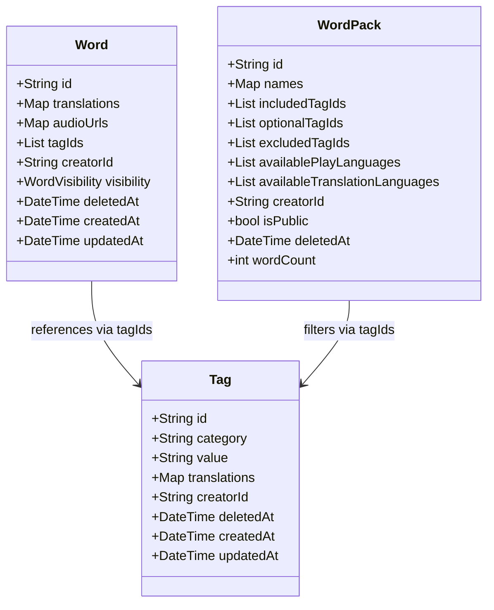
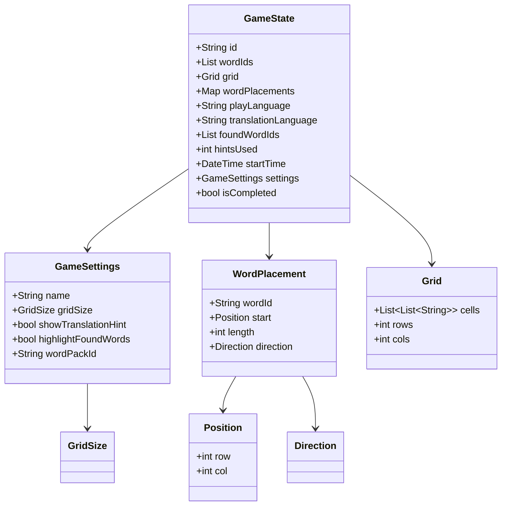
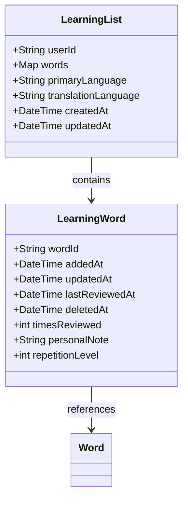
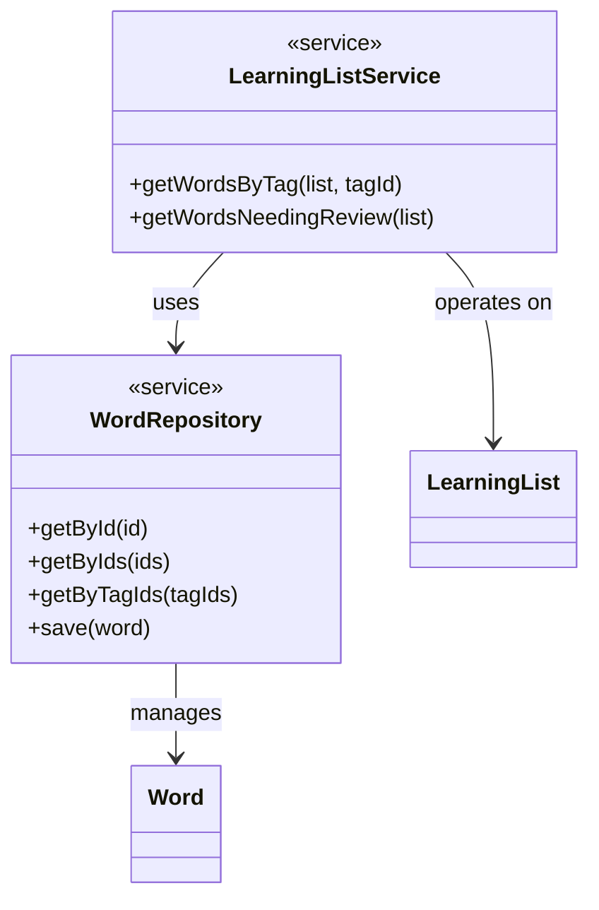

# Class Diagram

This diagram shows the complete data model and relationships for the Word Game app.

## Overview

The architecture follows clean architecture principles with:
- **Models**: Immutable data classes (using freezed)
- **Repositories**: Data access layer
- **Services**: Business logic layer
- **Providers**: State management (Riverpod)

## Core Entities



## Game System



## Learning System



## Service Layer



## Enumerations

### WordVisibility
- `public` - visible to all, searchable
- `private` - only visible to creator
- `unlisted` - visible with direct link

### GridSize
- `small_10x10` - 10x10 grid
- `medium_15x15` - 15x15 grid
- `large_20x20` - 20x20 grid

### Direction
- `horizontal` / `horizontalReverse`
- `vertical` / `verticalReverse`
- `diagonalDown` / `diagonalDownReverse`
- `diagonalUp` / `diagonalUpReverse`

## Static Helper Classes

### TagCategories
```dart
static const String cefr = 'cefr';           // A1, A2, B1, B2, C1, C2
static const String topic = 'topic';         // animals, food, travel, etc.
static const String wordType = 'word_type';  // noun, verb, adjective
static const String custom = 'custom';       // user-defined
```

### Languages
```dart
static const String german = 'de';
static const String english = 'en';
static const String spanish = 'es';
static const List<String> supported = [german, english, spanish];
```

## Key Design Principles

### 1. Normalized Data Storage
- **GameState** stores word IDs, not full Word objects
- Reduces storage size and enables word updates without breaking saved games
- Full words fetched on-demand via WordRepository

### 2. Tag-Based Organization
- Words and WordPacks reference tags by ID string (`'cefr:A1'`, `'topic:animals'`)
- Tags have multilingual translations for UI display
- Flexible filtering: combine tags with AND/OR logic

### 3. Soft Delete Pattern
- All entities use `deletedAt` timestamp instead of hard delete
- Enables sync, undo functionality, and data recovery
- Queries filter out deleted items automatically

### 4. Multi-Language Support
Three distinct language concepts:
- **UI Language**: Interface language (buttons, menus)
- **Play Language**: Language of words in game grid
- **Translation Language**: Language for hints/translations

### 5. Immutability with Freezed
- All models use `@freezed` annotation
- Generated `copyWith`, `==`, `hashCode`, `toString`
- Type-safe JSON serialization
- Works seamlessly with Hive storage

### 6. Service Layer Separation
- **Models**: Pure data (no business logic)
- **Repositories**: Data access and queries
- **Services**: Cross-aggregate operations and business logic

## Detailed Entity Descriptions

### Word
**Purpose**: Core vocabulary entity with multilingual support

**Key Fields**:
- `translations`: Map of language code to word text
- `audioUrls`: Map of language code to pronunciation URL
- `tagIds`: List of tag IDs (e.g., `['cefr:A1', 'topic:animals']`)
- `creatorId`: null = system word, userId = user-created

**Example**:
```dart
Word(
  id: 'word_001',
  translations: {'de': 'Hund', 'en': 'dog', 'es': 'perro'},
  audioUrls: {'de': 'url_to_german_audio'},
  tagIds: ['cefr:A1', 'topic:animals', 'word_type:noun'],
  creatorId: null, // system word
  visibility: WordVisibility.public,
  deletedAt: null,
)
```

### Tag
**Purpose**: Categorization and filtering

**Key Fields**:
- `id`: Immutable identifier (format: `category:value`)
- `category`: Group tags (cefr, topic, word_type, custom)
- `value`: Unique value within category
- `translations`: Multilingual display names

**Example**:
```dart
Tag(
  id: 'topic:animals',
  category: 'topic',
  value: 'animals',
  translations: {'en': 'Animals', 'de': 'Tiere', 'es': 'Animales'},
  creatorId: null, // system tag
)
```

### WordPack
**Purpose**: Filtered collection of words for gameplay

**Key Fields**:
- `includedTagIds`: Words must have ALL these tags
- `optionalTagIds`: Words can have ANY of these tags
- `excludedTagIds`: Words must NOT have these tags
- `availablePlayLanguages`: Languages the pack supports for gameplay
- `availableTranslationLanguages`: Languages available for translations

**Example**:
```dart
WordPack(
  id: 'pack_a1_animals',
  names: {'en': 'Beginner Animals', 'de': 'Tiere für Anfänger'},
  includedTagIds: ['cefr:A1', 'topic:animals'], // Must have both
  availablePlayLanguages: ['de', 'es'],
  availableTranslationLanguages: ['en', 'de'],
)
```

### GameState
**Purpose**: Complete state of an active or saved game

**Key Fields**:
- `wordIds`: References to words (not full objects)
- `wordPlacements`: Efficient storage (start + direction + length)
- `playLanguage`: Language of words in grid
- `translationLanguage`: Language for hints

**Storage Efficiency**:
- Storing word IDs instead of full objects reduces save file size by ~90%
- WordPlacement stores 3 values instead of potentially dozens of positions

### WordPlacement
**Purpose**: Efficiently store word location in grid

**Design**:
```dart
WordPlacement(
  wordId: 'word_001',
  start: Position(row: 2, col: 3),
  length: 4,
  direction: Direction.horizontal,
)
```

Positions computed on-demand:
```dart
List<Position> getPositions() {
  // Calculates all positions based on start, direction, length
  // Not stored - computed when needed
}
```

### LearningList
**Purpose**: Track words user is learning

**Key Fields**:
- `primaryLanguage`: Language being learned (e.g., 'de')
- `translationLanguage`: Reference language (e.g., 'en')
- `words`: Map of wordId to LearningWord metadata

**Design Note**: Learning lists are language-pair specific. If user learns both German→English and Spanish→English, these are separate lists.

## Data Relationships

### Word → Tag (Many-to-Many)
- Words store tag IDs in a list
- Tags exist independently
- Updating a tag's translation updates all words automatically

### WordPack → Tag (Filter Relationship)
- WordPacks define tag filters (include/exclude/optional)
- At runtime, query words matching filter criteria
- Dynamic: adding words with matching tags automatically includes them

### GameState → Word (Reference)
- GameState stores only word IDs
- Full Word objects fetched via WordRepository when needed
- Allows word updates without breaking saved games

### LearningWord → Word (Reference)
- LearningWord stores only word ID
- Metadata (review dates, difficulty) stored separately
- Same word can be in multiple learning lists (different language pairs)

## Storage Strategy

**Hive Boxes (NoSQL)**:
```dart
Box<Word> wordsBox;
Box<Tag> tagsBox;
Box<WordPack> wordPacksBox;
Box<GameState> gameStatesBox;
Box<LearningList> learningListBox;
Box<AppSettings> appSettingsBox;
```

**Why Hive**:
- Type-safe with generated adapters
- Fast tag-based queries
- Cross-platform (Android, iOS, Web)
- Works seamlessly with freezed models
- No SQL schema migrations

## Query Examples

### Find A1 Animal Words
```dart
final words = await wordRepository.getByTagIds(['cefr:A1', 'topic:animals']);
// Returns words that have BOTH tags
```

### Get Words for Pack
```dart
// Pack definition
final pack = WordPack(
  includedTagIds: ['cefr:A1', 'topic:animals'],
  excludedTagIds: ['word_type:verb'],
);

// Query
final words = await wordRepository.getByTagIds(pack.includedTagIds);
final filtered = words.where((w) => 
  !pack.excludedTagIds.any((excludeId) => w.tagIds.contains(excludeId))
);
```

### Load Game with Words
```dart
// Load game state
final gameState = await gameRepository.getById(gameId);

// Fetch full word objects
final words = await wordRepository.getByIds(gameState.wordIds);

// Now have both game state and word data
```

## Related Documentation

- [Full Architecture Documentation](../architecture.md)
- [Data Flow Examples](../data-flow.md)
- [API Documentation](../api.md)

---

*Last updated: January 2026*
