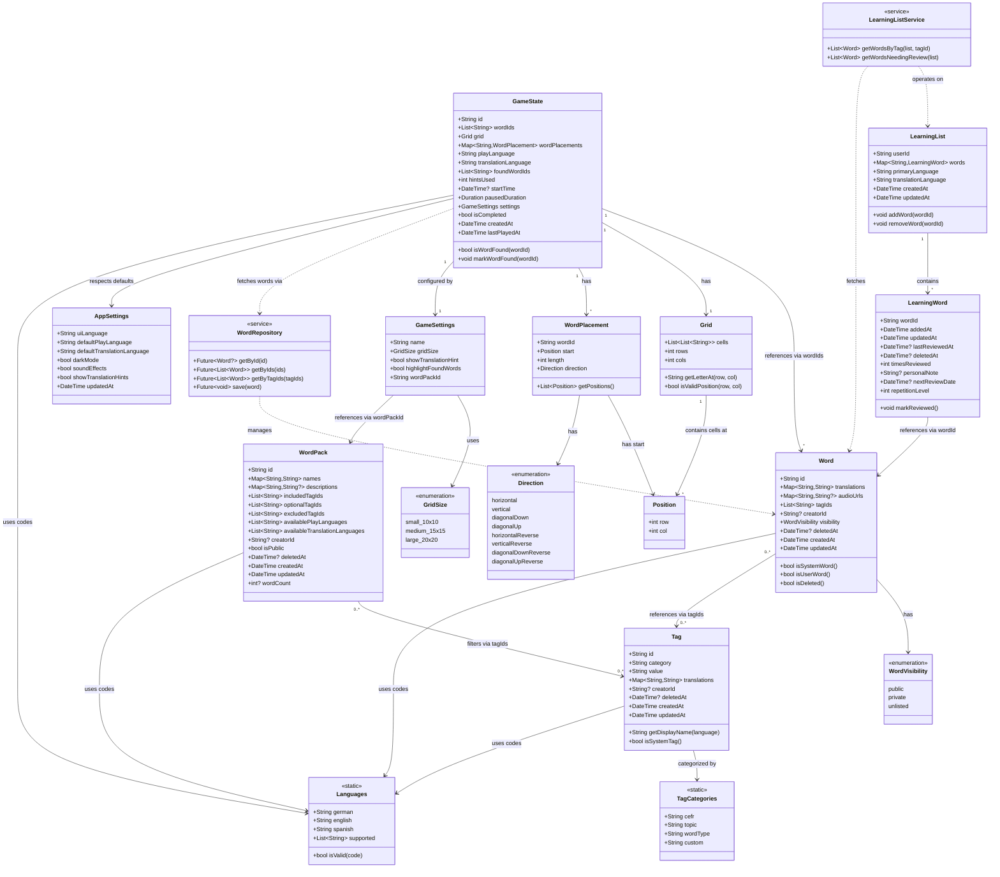

# Class Diagram

This diagram shows the complete data model and relationships for the Word Game app.

## Overview

The architecture follows clean architecture principles with:
- **Models**: Immutable data classes (using freezed)
- **Repositories**: Data access layer
- **Services**: Business logic layer
- **Providers**: State management (Riverpod)

## Full Class Diagram

## Key Design Principles

### 1. Normalized Data Storage
- **GameState** stores word IDs, not full Word objects
- Reduces storage size and enables word updates without breaking saved games
- Full words fetched on-demand via WordRepository

### 2. Tag-Based Organization
- Words and WordPacks reference tags by ID string (`'cefr:A1'`, `'topic:animals'`)
- Tags have multilingual translations for UI display
- Flexible filtering: combine tags with AND/OR logic

### 3. Soft Delete Pattern
- All entities use `deletedAt` timestamp instead of hard delete
- Enables sync, undo functionality, and data recovery
- Queries filter out deleted items automatically

### 4. Multi-Language Support
Three distinct language concepts:
- **UI Language**: Interface language (buttons, menus)
- **Play Language**: Language of words in game grid
- **Translation Language**: Language for hints/translations

### 5. Immutability with Freezed
- All models use `@freezed` annotation
- Generated `copyWith`, `==`, `hashCode`, `toString`
- Type-safe JSON serialization
- Works seamlessly with Hive storage

### 6. Service Layer Separation
- **Models**: Pure data (no business logic)
- **Repositories**: Data access and queries
- **Services**: Cross-aggregate operations and business logic

## Core Entities

### Word
- Multilingual translations and audio
- Tagged with CEFR level, topic, word type
- Can be system-provided or user-created
- Supports soft delete

### Tag
- Category-value structure (e.g., `cefr:A1`)
- Multilingual display names
- Immutable ID for referencing

### WordPack
- Tag-based filtering (include/exclude/optional)
- Multilingual names and descriptions
- Specifies available play and translation languages
- Cached word count for performance

### GameState
- References words by ID only
- Efficient WordPlacement (start + direction + length)
- Full save/resume capability
- Language-specific configuration

### LearningList
- Language-pair specific (German→English separate from Spanish→English)
- Tracks review history and spaced repetition data
- Sync-ready with timestamps and tombstones

## Storage Strategy

All data stored in **Hive** (NoSQL):
- Type-safe with generated adapters
- Fast queries for tag-based filtering
- Works seamlessly with freezed models
- Cross-platform (Android, iOS, Web)

